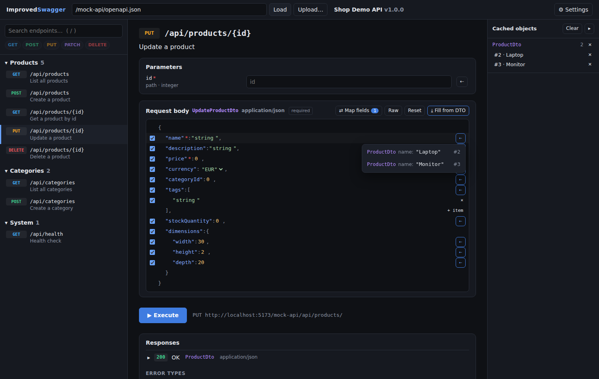
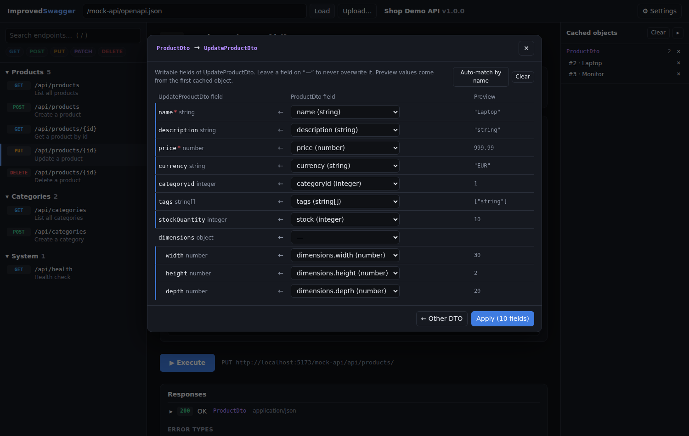

# Improved Swagger

Eine bessere Oberfläche zum Testen von REST-APIs auf Basis der `openapi.json` / `swagger.json`,
die Swagger/Springdoc/Swashbuckle ohnehin generieren. Fokus: **schnell Requests bauen, ohne Copy & Paste**.



## Schnellstart

```bash
npm install
npm run dev        # http://localhost:5173 – lädt automatisch die Demo-API
```

Eigene API: oben die URL zur Spec eintragen (z. B. `http://localhost:8080/v3/api-docs`) und **Load** – oder die JSON-Datei hochladen.

Weitere Skripte: `npm test` (Unit-Tests), `npm run typecheck`, `npm run build`.

## Was die erste Iteration kann

| Bereich | Funktion |
|---|---|
| **Endpunktliste (links)** | Gruppiert nach Tags wie in Swagger, Suchleiste (`/` fokussiert sie, mehrere Begriffe = UND), Filter-Chips pro HTTP-Methode. |
| **Detailansicht (Mitte)** | Parameter, Request Body, Execute, Response, dokumentierte Responses – getrennt in Erfolg und **Error types** – jeweils mit Beispiel und Schema. |
| **Request Body mit Checkboxen** | Der Beispiel-Body wird als JSON-Baum angezeigt; jedes Feld (und jedes Array-Item) hat links eine Checkbox. Deaktivierte Felder werden nicht gesendet. `readOnly`-Felder (z. B. `id`, `createdAt`) sind von Anfang an deaktiviert. Werte direkt inline editierbar, Enums als Dropdown, Umschalten auf Raw-JSON möglich. |
| **Zwischenspeicher (rechts)** | Jede erfolgreiche Response wird anhand des dokumentierten Response-Schemas als DTO gespeichert (z. B. `GET /products` → n × `ProductDto`). Gleiche `id` ersetzt das alte Objekt statt es zu duplizieren. |
| **⇄ Map fields** | Auswahl des Quell-DTOs (mit Suche, DTOs mit gecachten Objekten zuerst) → Dialog, in dem Felder des Quell-DTOs auf die *schreibbaren* Felder des Request-DTOs gemappt werden. Gleichnamige Felder werden automatisch vorgeschlagen, „—“ heißt: dieses Feld nie überschreiben. **Apply** speichert das Mapping. |
| **⇠ pro Feld** | Rechts neben jedem gemappten Feld: Hover zeigt die gecachten Objekte als `DTO-Name  feld: wert` – Klick übernimmt genau diesen Wert. |
| **⤓ Fill from DTO** | Oben rechts am JSON: wendet alle gemappten Felder eines gecachten Objekts auf einmal an. Pfad-Parameter wie `{id}` / `{productId}` werden dabei gleich mitgesetzt. |
| **Persistenz** | Mappings, Zwischenspeicher, Entwürfe pro Endpunkt und Einstellungen liegen im `localStorage` und überleben einen Reload. |
| **CORS** | Requests an andere Origins laufen im Dev-Server über einen kleinen Proxy (`/__proxy`), damit man die API nicht extra für CORS konfigurieren muss. Abschaltbar unter ⚙ Settings, dort auch Base-URL-Override und Bearer-Token. |

### Beispiel-Flow mit der Demo-API

1. `POST /api/products` → Body ist vorausgefüllt, `id` ist bereits abgehakt → **Execute**.
2. `GET /api/products` → **Execute** → rechts erscheinen die `ProductDto`s.
3. `PUT /api/products/{id}` → **⇄ Map fields** → `ProductDto` wählen → `stockQuantity ← stock` ergänzen → **Apply**.
4. Über **⤓ Fill from DTO** ein Produkt komplett übernehmen (inkl. `{id}`), oder über **⇠** einzelne Felder aus verschiedenen Objekten ziehen → **Execute**.



## Aufbau

```
src/
  openapi/spec.ts      Spec lesen (OpenAPI 3.x + Swagger 2.0), $ref/allOf auflösen, Operationen extrahieren
  openapi/example.ts   Beispielwerte aus Schemas generieren
  openapi/fields.ts    Schema → flache Feldliste (Punkt-Pfade), Auto-Match für Mappings
  body/tree.ts         Editierbarer JSON-Baum mit an/aus pro Feld
  mapping.ts           Mapping anwenden, Kandidaten pro Feld / pro Objekt
  store.ts             Globaler State (Cache, Mappings, Drafts) + localStorage
  request.ts           Request bauen/ausführen, Responses cachen
  components/          Sidebar, EndpointView, BodyEditor, MappingDialog, CapturePanel, …
mock/                  Demo-API (In-Memory) + Dev-Proxy als Vite-Plugin
```

Zentrale Begriffe:

- **DTO-Name** = Name des Schemas aus `components/schemas` (bzw. `definitions`), wie er per `$ref` an Request/Response hängt. Inline-Schemas bekommen einen synthetischen Namen wie `GET /api/health response`.
- **Mapping** = `{ sourceDto, targetDto, fields: { zielPfad: quellPfad } }`. Mappings gelten pro DTO-Paar, also für *alle* Endpunkte, die dasselbe Request-DTO verwenden.

## Bewusst noch nicht drin / Ideen für die nächsten Iterationen

- YAML-Specs, externe `$ref`s, `multipart/form-data` und andere Content-Types als JSON
- Auth-Flows aus `securitySchemes` (aktuell nur ein globales Bearer-Token)
- Mapping in Query-Parameter (Pfad-Parameter werden per Namens-Heuristik gefüllt)
- Mehrere Environments (dev/staging) und Request-Historie
- Verschachtelte Objekte in Arrays mappen (aktuell: Arrays werden als Ganzes gemappt)
- Response-Wrapper wie `{ items: [...], total }` beim Cachen auspacken
- Ohne Dev-Server (statischer Build) gibt es weder Mock-API noch Proxy – dann braucht die Ziel-API CORS
